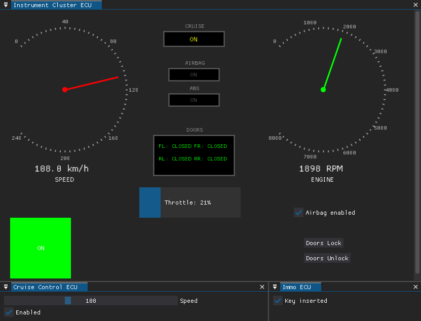

# EvilDoggie Workshop Car Simulator

## Project Presentation

Welcome to the EvilDoggie Workshop Car Simulator repository! This tool replicates the car CAN Bus environment used in the Black Hat Arsenal 2025 session. Developed by Faraday Security, the simulator emulates multiple Electronic Control Units (ECUs) in a vehicle, allowing researchers to practice offensive CAN Bus attacks with EvilDoggie in a controlled setting.

The simulator supports both serial and SocketCAN interfaces, enabling seamless integration with Doggie hardware for sniffing, injecting, and manipulating CAN messages. It's designed for educational purposes in automotive security, focusing on challenges like VIN spoofing, door unlocking, cruise control confusion, airbag toggling, ABS disconnection, and more—as detailed in the attached workshop guides.

This open-source simulator is licensed under MIT and is part of the broader Doggie/EvilDoggie ecosystem. For the full firmware and hardware details, visit the [main repository](https://github.com/infobyte/doggie).

Refer to [evilDoggie Workshop documentation](https://infobyte.github.io/doggie/workshop/intro/) for a full workshop guide.




## Setup with 2 Doggies

To run the simulator you need 2 Doggies (one for TX and one for RX), 3 Doggies are recommended—one as the attacker (EvilDoggie) and two as simulated ECUs—to ensure messages propagate over a real physical bus.

### Step 1: Create and Activate a Virtual Environment
Create a Python virtual environment to isolate dependencies:

```bash
python3 -m venv doggie_venv
source doggie_venv/bin/activate
```

### Step 2: Install Requirements
Install the required packages from `requirements.txt`:

```bash
python3 -m pip install -r requirements.txt
```

### Step 3: Install the Package
Install the simulator package locally:

```bash
python3 -m pip install -e .
```

### Step 4: Run the Simulator
Launch the simulator using serial or SocketCAN interfaces. For a 2-Doggie setup, connect two Doggies to your system (e.g., via USB) and identify their ports (e.g., `/dev/ttyUSB0` and `/dev/ttyUSB1`). Use the `--serial` option for serial connections or `--socketcan` for virtual CAN interfaces.

Example with serial interfaces (adjust ports and baudrates as needed):

```bash
python3 -m doggie_lab --serial /dev/ttyUSB0@921600 /dev/ttyUSB1@921600 --speed 500000
```

- `--serial TX_PORT RX_PORT`: Specify serial ports and baudrates (e.g., `/dev/ttyUSB0@115200 /dev/ttyUSB1@115200`).
- `--speed SPEED`: Set CAN Bus speed in bits per second (default: 500000).

For SocketCAN (virtual interfaces):

```bash
python3 -m doggie_lab --socketcan can0 can1 --speed 500000
```

- `--socketcan TX_CAN RX_CAN`: Use SocketCAN interfaces (e.g., `can0 can1`).

Run `python3 -m doggie_lab --help` for full options.

### Using Virtual CAN Interfaces
For quick testing without hardware, you can simulate a single virtual CAN interface on Linux using SocketCAN. This is ideal for basic sniffing or injection but won't replicate physical bus behaviors needed for advanced challenges.

Setup a virtual CAN interface:
1. Load the vcan module: `sudo modprobe vcan`.
2. Create and bring up the interface: `sudo ip link add dev vcan0 type vcan` and `sudo ip link set up vcan0`.
3. Run the simulator with `--socketcan vcan0 vcan0` (using the same interface for TX/RX loopback).

However, for all workshop challenges, physical Doggies are essential to observe real bus interactions, such as error propagation and contention. Use at least 3 Doggies: two for ECU simulation (TX/RX) and one as the EvilDoggie attacker connected to the shared physical bus.

## Requirements
- Python 3.8+
- Dependencies listed in `requirements.txt` (e.g., python-can, tkinter for UI).

## Disclaimer
This simulator is for research and training only. Do not use on real vehicles. Contributions welcome—open issues or PRs for improvements!

## License  
This project is licensed under the MIT License. See the [LICENSE](https://github.com/infobyte/doggie_workshop/blob/main/LICENSE) file for details.
